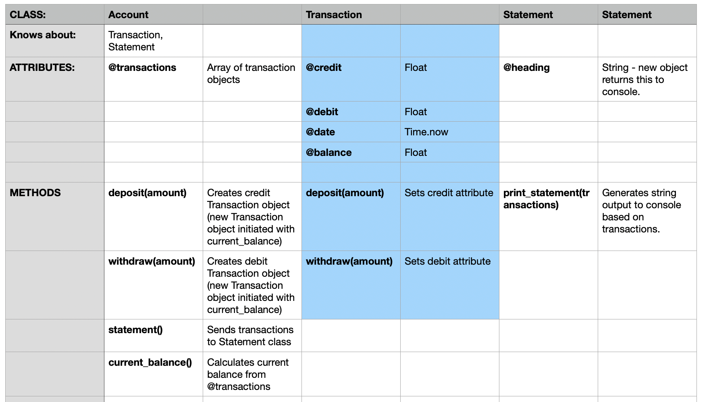

# Bank tech test

Technologies used:

- Ruby 2.7.3 (including BigDecimal library)
- Rubocop (linting)
- RSpec (testing)
- SimpleCov (coverage)

## Specification

### Requirements

- You should be able to interact with your code via a REPL like IRB or the JavaScript console. (You don't need to implement a command line interface that takes input from STDIN.)
- Deposits, withdrawal.
- Account statement (date, amount, balance) printing.
- Data can be kept in memory (it doesn't need to be stored to a database or anything).

### Acceptance criteria

**Given** a client makes a deposit of 1000 on 10-01-2023  
**And** a deposit of 2000 on 13-01-2023  
**And** a withdrawal of 500 on 14-01-2023  
**When** she prints her bank statement  
**Then** she would see

```
date || credit || debit || balance
14/01/2023 || || 500.00 || 2500.00
13/01/2023 || 2000.00 || || 3000.00
10/01/2023 || 1000.00 || || 1000.00
```

## User stories

```
As a client
So that I can undertake banking activities
I want to open a new account

As a client
So that I can save money
I want to deposit money into my account

As a client
So I can spend my savings
I want to withdraw money from my account

As a client
So I can keep track of my transactions
I want the date to be recorded on a deposit or withdrawal

As a client
So that I can see a record of my banking activity
I want to print a statement of my transactions
```

## Class diagram



## Progress log

- Day 1
- set up local and github repo
- turned requirements into user stories
- modelled a basic class diagram
- set up project with rspec, rubocop, simplecov
- wrote very basic test for Account class - decided more logical to start with Transaction class
- basic withdrawal/deposit tests written and passed
- enjoyed 'transaction initialised with current date' test, as had to mock ('freeze') time
- transaction class done in a fairly simple form: wondering whether to put in edge case testing (i.e. for non-floats) in this class or in Account class: Account class seems most logical place to do this, so Transaction class is then not bound to any restrictions and could hypothetically then be used by other non-float based classes
- end of day 1: have made progress with account class and have tested it with considerable mocking/doubling of transaction class. Code requires refactoring.
- Day 2
- refactored account class
- worked on printer class: wrote tests, wrote big clunky working method, and then refactored
- fixed bug in Account class (exposed by feature test): was sending current balance to transaction before adding/subtracting the current transaction
- (temporarily?) added nil returns on deposit, withdraw, and statement methods in Account to prevent transaction array being logged in the terminal
- have provided messages for withdraw and deposite methods instead of nil return
- have learned about and implemented BigDecimal to handle floating point calculations owing to Ruby float inaccuracies (try `1.40 + 1.60` in irb!): I have decided to use BigDecimal in Transaction class despite earlier thoughts as it seems more straightforward to 'read' the code if BigDecimal used here. May involve extracting some balance logic from Account though.
- have made tests for account more robust - now checks that current balance is sent to a new Transaction instance
- Transaction now calculates balance based on the current_balance sent from Account plus or minus the deposit/withdraw value: this makes it easier to follow the logic
- the only calculation now performed in the Account class is the sum of the transactions array: which is populated with BigDecimal values
- Day 3
- aiming to get this finished today: need to implement non-valid input handling; better time freezing; and general refactoring.

Thoughts

- time freezing in tests could be done better - explore Timecop?
- need to handle non-numeric and invalid numeric (negative, values with more than 2 decimal places) entries
