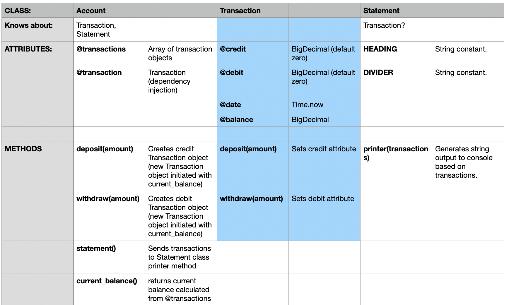

# Bank tech test

## Specification

### Requirements

- You should be able to interact with your code via a REPL like IRB or the JavaScript console. (You don't need to implement a command line interface that takes input from STDIN.)
- Deposits, withdrawal.
- Account statement (date, amount, balance) printing.
- Data can be kept in memory (it doesn't need to be stored to a database or anything).

### Acceptance criteria

**Given** a client makes a deposit of 1000 on 10-01-2023  
**And** a deposit of 2000 on 13-01-2023  
**And** a withdrawal of 500 on 14-01-2023  
**When** she prints her bank statement  
**Then** she would see

```
date || credit || debit || balance
14/01/2023 || || 500.00 || 2500.00
13/01/2023 || 2000.00 || || 3000.00
10/01/2023 || 1000.00 || || 1000.00
```

## User stories

```
As a client
So that I can undertake banking activities
I want to open a new account

As a client
So that I can save money
I want to deposit money into my account

As a client
So I can spend my savings
I want to withdraw money from my account

As a client
So I can keep track of my transactions
I want the date to be recorded on a deposit or withdrawal

As a client
So that I can see a record of my banking activity
I want to print a statement of my transactions
```

## Class diagram



## Progress

- set up local and github repo
- turned requirements into user stories
- modelled a basic class diagram
